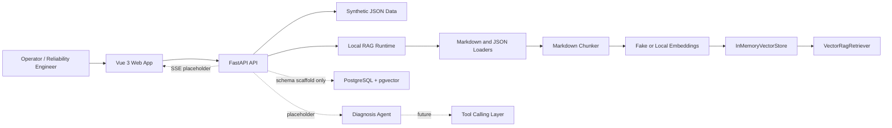
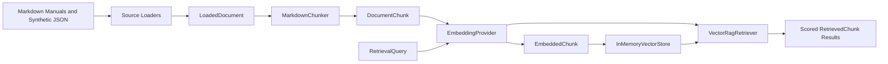

# Architecture

## System Overview

## Current Scope

The repository implements the application foundation and a local, process-scoped RAG MVP. It does not yet implement an AI diagnosis workflow.

- Web pages for dashboards, machines, incidents, documents, diagnosis results, and evaluation.
- FastAPI endpoints with typed Pydantic response models.
- JSON-backed synthetic operational data.
- Markdown and JSON knowledge loaders.
- Heading-aware document chunking.
- Deterministic fake embeddings by default and an optional local sentence-transformer provider.
- In-memory cosine-similarity retrieval with scored results.
- Retrieval evaluation against static RAG cases.
- Docker Compose PostgreSQL service with `pgvector` enabled.
- SQL schema scaffolding for documents, chunks, and ingestion runs.
- Placeholder diagnosis-agent, tool-calling, and human-review interfaces.
- Server-Sent Events placeholder for future diagnosis progress updates.
- Mock agent trace endpoint and frontend page for future observability.
- Placeholder general document ingestion and document chunk-preview endpoints.

## Backend Modules

- `app/main.py`: FastAPI application factory and router registration.
- `app/api/routes`: HTTP route modules grouped by domain.
- `app/schemas`: Pydantic API contracts.
- `app/data/synthetic_loader.py`: reads typed fixtures from `data/synthetic`.
- `app/data/mock_data.py`: temporary facade for synthetic routes and placeholder workflow responses.
- `app/rag/runtime.py`: wires the active local embedding provider, in-memory store, and retriever.
- `app/rag/document_loader.py`: loads local Markdown documents.
- `app/rag/json_knowledge_loader.py`: converts supported synthetic JSON records into knowledge documents.
- `app/rag/chunker.py`: splits loaded content into heading-aware chunks.
- `app/rag/embeddings.py`: fake and optional local embedding providers.
- `app/rag/vector_store.py`: active in-memory vector store plus a future persistent-store boundary.
- `app/rag/retriever.py`: active vector retriever plus a retained placeholder implementation.
- `app/rag/evaluation.py`: loads and evaluates RAG retrieval cases.
- `app/agent`: reserved manual diagnosis-agent implementation area with typed placeholders.

## Active RAG Runtime

Runtime behavior:

- The default `FakeEmbeddingProvider` creates deterministic 1,536-dimensional hash vectors. It validates the pipeline but is not a semantic model.
- `LocalSentenceTransformerEmbeddingProvider` supports local semantic embeddings and defaults to `intfloat/multilingual-e5-small`.
- `InMemoryVectorStore` stores embedded chunks in the API process and ranks them with cosine similarity.
- The index starts empty, can be populated with local ingestion endpoints, and is cleared on process restart.
- `VectorRagRetriever` embeds each query and returns scored chunks with document and section metadata.

RAG endpoints:

- `GET /rag/status`: reports the configured provider, model, store type, and record count.
- `POST /rag/clear`: clears the process-local index.
- `POST /rag/ingest-local-manuals`: loads Markdown manuals only.
- `POST /rag/ingest-local-knowledge-base`: loads Markdown manuals and supported synthetic JSON records.
- `POST /rag/search`: runs vector retrieval and returns non-placeholder results.
- `POST /rag/evaluate`: runs the five RAG cases after an index has been populated.

## Database and Document API Scaffold

Database bootstrap scripts create:

- `documents`: document metadata such as title, source type, path, domain, and machine type.
- `document_chunks`: chunk records with section metadata and an `embedding vector(1536)` column.
- `document_ingestion_runs`: status records for future ingestion jobs.

Current status:

- The active RAG runtime does not connect to PostgreSQL or pgvector.
- `POST /documents/ingest` records no data and returns a placeholder accepted response.
- `GET /documents/{document_id}/chunks` returns placeholder chunks generated from synthetic manual section metadata.
- Persistent ingestion, pgvector writes, pgvector search, lexical retrieval, hybrid fusion, and reranking remain future work.

## Synthetic Data Domains

- Machines: five hydraulic assets across excavator, crane, pump, press, and test-rig contexts.
- Telemetry scenarios: five current readings and summaries, one for each asset.
- Error codes: 20 hydraulic, pump, accumulator, thermal, vibration, sensor, and electrical codes.
- Manuals: five metadata records plus a Markdown troubleshooting manual.
- Repair cases: 30 cases mapped to incident responses.
- Diagnosis evaluation cases: 10 static cases for future scoring workflows.
- RAG evaluation cases: five executable retrieval cases.

## Frontend Modules

- `src/router`: page routing.
- `src/stores`: Pinia stores for machines, incidents, and documents.
- `src/api`: typed API client wrapper.
- `src/types`: shared frontend domain types.
- `src/views`: main application pages.
- `src/components/AppShell.vue`: navigation and layout frame.

## Future Evolution

1. Add migrations and replace the in-memory vector store with PostgreSQL/pgvector persistence.
2. Connect the general document ingestion API and UI to the active RAG pipeline.
3. Add additional parsers, lexical retrieval, hybrid fusion, and reranking.
4. Package the optional local embedding provider as a reproducible dependency extra.
5. Integrate retrieved evidence with a diagnosis graph behind `app/agent`.
6. Add safe tool adapters for telemetry lookup, CMMS tickets, and maintenance history.
7. Add human review states, approvals, durable traces, and audit logs.
