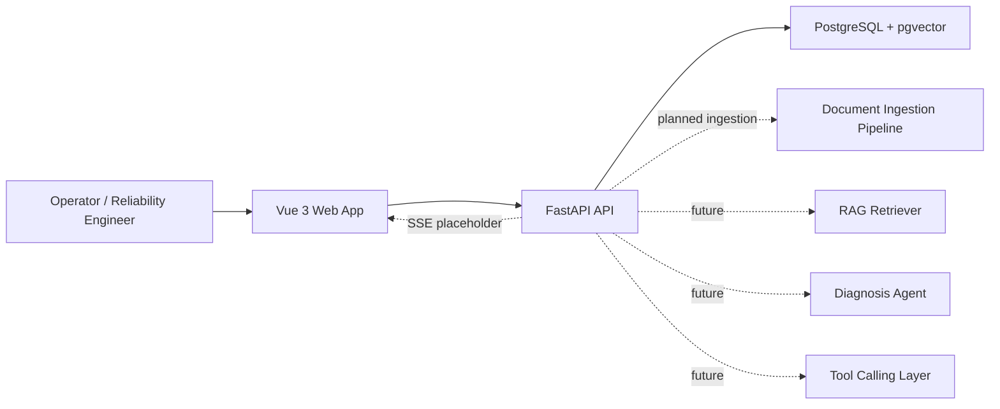
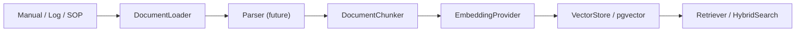

# Architecture

## System Overview

## Current Scope

This skeleton implements the non-AI application foundation only.

- Web pages for dashboards, machines, incidents, documents, diagnosis results, and evaluation.
- FastAPI endpoints with typed Pydantic response models.
- JSON-backed synthetic data so the UI can be wired before database persistence exists.
- Docker Compose PostgreSQL service with `pgvector` enabled.
- SQL schema scaffolding for documents, chunks, and ingestion runs.
- Placeholder interfaces for future AI and automation components.
- Server-Sent Events placeholder for future diagnosis progress updates.
- Mock agent trace endpoint and frontend page for future observability.
- Placeholder RAG search endpoint and document chunk preview UI.

## Backend Modules

- `app/main.py`: FastAPI application factory and router registration.
- `app/api/routes`: HTTP route modules grouped by domain.
- `app/schemas`: Pydantic API contracts.
- `app/data/synthetic_loader.py`: reads typed fixtures from `data/synthetic`.
- `app/data/mock_data.py`: temporary service facade used by routes.
- `app/rag`: reserved manual RAG implementation area with typed placeholders.
- `app/agent`: reserved manual diagnosis-agent implementation area with typed placeholders.

## RAG Infrastructure Scaffold

Database bootstrap scripts create:

- `documents`: document metadata such as title, source type, path, domain, and machine type.
- `document_chunks`: chunk records with section metadata and an `embedding vector(1536)` placeholder.
- `document_ingestion_runs`: status records for future ingestion jobs.

Planned ingestion flow:

Current status:

- `POST /documents/ingest` records no data and returns a placeholder accepted response.
- `GET /documents/{document_id}/chunks` returns placeholder chunks generated from synthetic manual section metadata.
- `POST /rag/search` returns placeholder chunk previews and does not run embeddings, vector search, hybrid search, reranking, or LLM logic.
- Manual implementation is still required for loading, parsing, chunking, embeddings, vector storage, retrieval, and hybrid search.

## Synthetic Data Domains

- Machines: five hydraulic assets across excavator, crane, pump, press, and test-rig contexts.
- Telemetry scenarios: current readings and summaries for each asset.
- Error codes: at least 20 hydraulic, pump, accumulator, thermal, vibration, sensor, and electrical codes.
- Manuals: maintenance manual metadata and section names.
- Repair cases: 30 cases mapped to incident responses.
- Evaluation cases: 10 static cases for future scoring workflows.

## Frontend Modules

- `src/router`: page routing.
- `src/stores`: Pinia stores for machines, incidents, and documents.
- `src/api`: typed API client wrapper.
- `src/types`: shared frontend domain types.
- `src/views`: main application pages.
- `src/components/AppShell.vue`: navigation and layout frame.

## Future Evolution

1. Replace seeded data with database repositories.
2. Add a real migration workflow and persistence repositories.
3. Implement document upload, parsing, chunking, embedding, and vector search.
4. Add RAG retrieval behind the reserved `app/rag` interfaces.
5. Add a diagnosis graph behind the reserved `app/agent` interfaces.
6. Add safe tool adapters for telemetry lookup, CMMS tickets, and maintenance history.
7. Add human review states, approvals, and audit logs.
